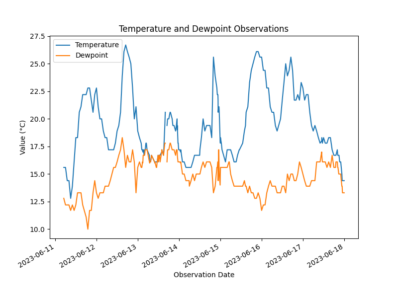

# weatherdag

An Airflow project for extracting National Weather Service observation data
and loading into a database.

## Motivation

This is a portfolio project meant to demonstrate knowledge
of data engineering technologies and practices:

* Apache Airflow ETL pipelines
* Data extraction from a web API into local raw data storage
* Data loading from local storage into a SQLite database
* Automatic creation and update of a visualization

## Background

The U.S. National Weather Service publishes data via a free web API.
For this project, we are interested in observation data collected
at a weather station specified by the user.

## Requirements

The environment must have the following PyPI packages and their dependencies:
* apache-airflow
* matplotlib
* pandas

## Airflow Configuration

The pipeline requires an Airflow variable to be created:

* Key: `weatherdag_config`
* Value: JSON string with the following keys:
  * `stationId`: NWS station id
  * `raw_folder`: Local folder to store raw data
  * `db_path`: Path of the SQLite database
  * `viz_path`: Folder to store visualizations
  * `start_date`: Start date for the DAG scheduler in YYYY-MM-DD format

Example value:
```
{
   "stationId":"KBOS",
   "raw_folder":"/home/airflow/raw",
   "db_path":"/home/airflow/db/weatherdag.sqlite3",
   "viz_folder":"/home/airflow/viz",
   "start_date":"2023-06-01"
}
```

Copy the files from the repository "dags" folder
into your Airflow DAGs directory:
* weatherdag.py
* weatherdag_utils.py
* weatherdag_ddl.sql

## Database Setup

Run the `weatherdag_update_db` DAG manually.
This will create the SQLite database file as specified above.

Future versions of the project may provide additions and updates
to the database views. Run the `weatherdag_update_db` DAG again
to update the views in the database to the latest version
without affecting the raw data already loaded.

## Running The Pipeline

Turn on the `weatherdag` DAG in Airflow.
The scheduler should automatically queue up DAG runs to backfill the data.
Note the NWS API does not return any data more than 7 days old.

## Output

The pipeline loads the raw data into a database table, `RAW_OBSERVATIONS`,
which has the following columns:

* `RUN_ID`: Airflow run ID
* `SYS_LOAD_TIME`: Date and time the data was loaded into the raw table
* `FILENAME`: Local filename the data was stored in
* `OBSERVATION`: JSON string containing the NWS observation data

There is also a view, `VW_PROPERTIES`,
which converts much of the observation data from JSON format
into a tabular format for querying.

After loading the data, the pipeline queries the database
to produce a visualization. An example is provided here:



## License

MIT license. See LICENSE file for details.